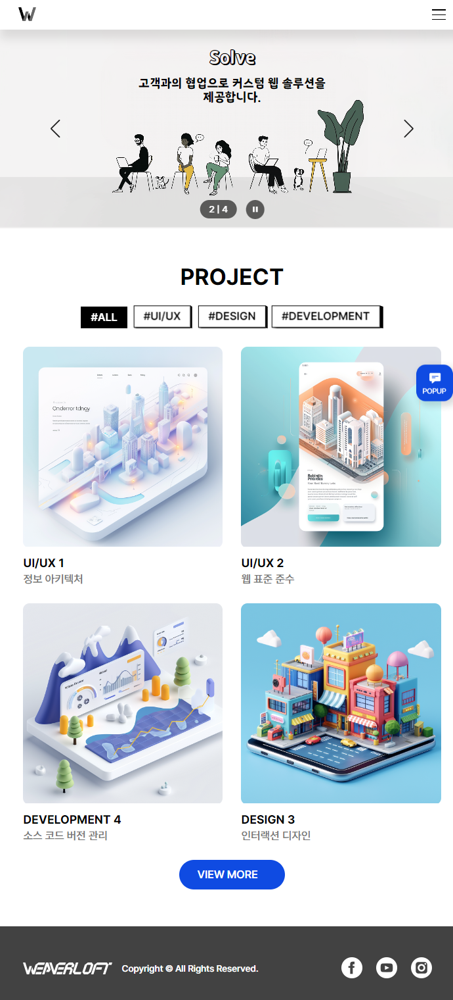
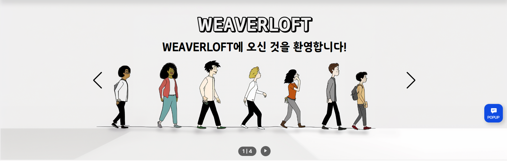
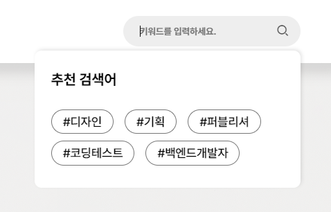
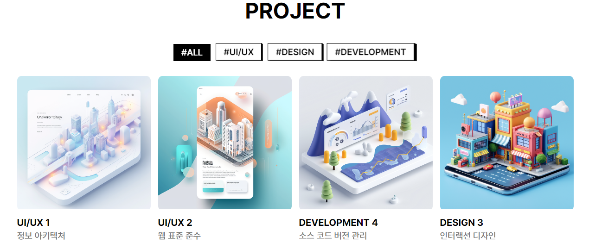
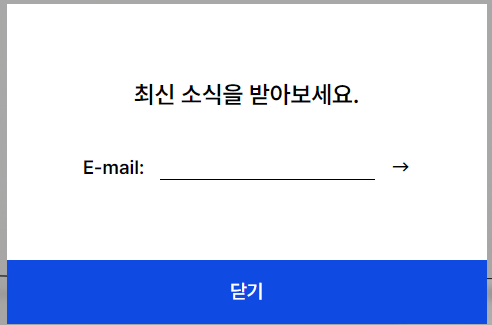
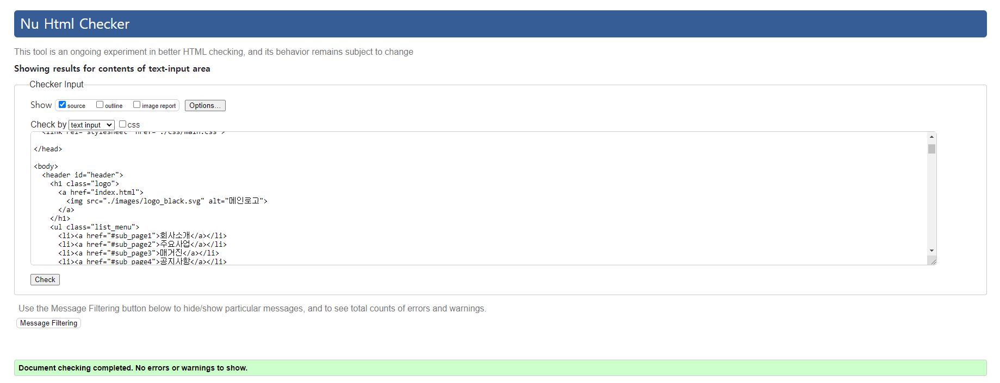
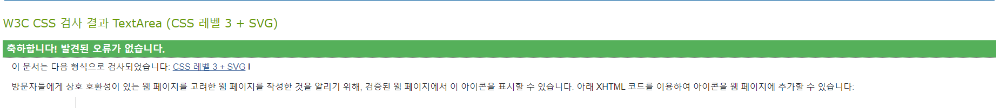

# 📄 개요
위버로프트 2차 실무 역량 평가 과제입니다.<br /><br />

## 🔍 프로젝트 소개
### 📗 사용한 도구
- Swiper (슬라이드 기능)
- XEicon (웹 아이콘)
- Midjourney (이미지 리소스 생성)
- Photoshop (이미지 편집)
- ChatGPT (문구 작성)

### 📒 글씨체
- Pretendard
- SamlipBasic
- SamlipOutline

### 📓 주요 기능

#### 1 &#41; 반응형



```css
/* 태블릿 */
@media (max-width: 1199px) { 
  html { font-size: 15px; } 

 .wrap { width: 90%; } 
 }

/* 모바일 */
@media (max-width: 767px) { html { font-size: 14px; } 
 }
```

단위를 rem으로 통일하여 1200px / 768px 구간에서 html의 `font-size`를 바꿔서 반응형으로 작동하도록 만들었습니다. <br /><br />

___

#### 2 &#41; 슬라이더



```javascript
renderFraction: function (currentClass, totalClass) {
  return `<span class="swiper-pagination-separator">|</span>`;
  }
```

스와이퍼를 사용하여 슬라이드 기능을 구현했습니다. 스와이퍼의 기본값 스타일을 바꾸기 위해서 renderFraction속성을 변경했습니다.<br /><br />

___

#### 3 &#41; 검색창



```javascript
setTimeout(function () { buttonBoxEl.classList.remove('active');
  }, 150)
```

헤더 검색창에서 `input:focus`됐을 때 추천검색어가 나타납니다.
추천검색어 클릭했을 때 링크 속도보다 검색창 `input`이 blur되는 속도가 더 빨라서 `setTimeout`함수로 비동기 처리했습니다.<br /><br />

___

#### 4 &#41; 컨텐츠 탭



```css
#project_area .box_tab .cont_tab { 
  perspective: 100px; 
  perspective-origin: 250% 250%; 
  transition: .1s; 
  } 

#project_area .box_tab .cont_tab.active { 
  perspective-origin: center; 
  } 

#project_area .box_tab .cont_tab .top { 
  transform-style: preserve-3d;
 } 
```

컨텐츠 탭에 `transform-style: preserve-3d;`를 적용해서 입체적인 효과를 넣었습니다. 클릭했을 때 `perspective-origin`을 250%에서 center로 바꿔서 버튼을 누르는 것처럼 보이게 했습니다.<br /><br />

___

#### 5 &#41; 팝업



```javascript
function scrollFix() {
      document.body.style.cssText = `
      position: fixed; 
      top: -${window.scrollY}px;
      overflow-y: scroll;
      width: 100%;`;
    }
```

팝업버튼을 눌렀을 때 스크롤이 안되도록 고정시켰습니다.<br /><br />

___

#### 6 &#41; 웹 표준





W3C 웹 표준 검사를 통해서 확인했습니다.